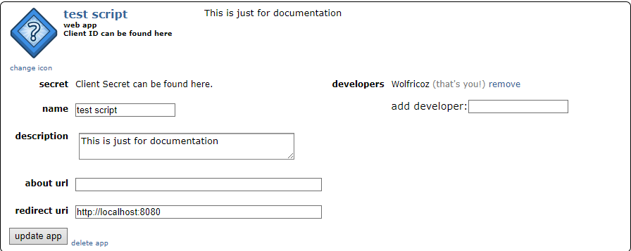

<h1 style="text-align: center">How to connect to reddit</h1>

* ### Create a Reddit Account:

If the user doesn't have a Reddit account, they need to sign up for one
at [Reddit's registration page](https://www.reddit.com/register).

* ### Create a Reddit App:

In order to use the Reddit API, the user needs to create a Reddit app. This is done by going
to [Reddit's App Preferences page and clicking](https://www.reddit.com/prefs/apps) on "Create App."

* ### Fill in the App Information:

The user selects the app type (preferably "script" for personal use).
Provide a name, description, and URLs for the app. The "redirect uri" should be a URL where the user's authentication
token will be sent. Use `http://localhost:8080`.

* ### Complete the Security Check:

Solve the CAPTCHA and click "Create app."

* ### Retrieve Client ID and Client Secret:

After creating the app, the user will see the app details page. Note down the "client ID" and "client secret." These
will be used in the authentication process.

